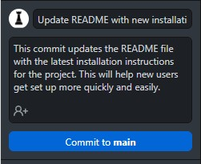

# Contributing to the Project

We welcome contributions from the community to help make our investigation of the impact of the 2022 ASUU strike on academic performance at the University of Lagos even better! Whether you're a team member or an open source contributor, there are many ways to get involved.

## Table of Contents

- [Contributing to the Project](#contributing-to-the-project)
  - [Table of Contents](#table-of-contents)
  - [Current Status](#current-status)
  - [Issues and Bugs](#issues-and-bugs)
  - [Pull Requests](#pull-requests)
  - [Commit Message Guidelines](#commit-message-guidelines)
    - [Preferred commit examples](#preferred-commit-examples)
    - [Don't commit like this](#dont-commit-like-this)
  - [Style Adherence](#style-adherence)
    - [Code Style Guide](#code-style-guide)
    - [Visualization Style Guide](#visualization-style-guide)
  - [Communication](#communication)

## Current Status

The project is ongoing and you can view more infomation on the timelines, status, and team members [here](https://docs.google.com/spreadsheets/d/1KOZ8djiRDPjkNfuNQMtF75yCSue4W52NH50ica-qXPk/edit#gid=0).

## Issues and Bugs

During the course of the project, we may encounter issues or bugs that affect our analysis and results. Some examples of issues and bugs that may arise include:

- Data cleaning errors: There may be errors in the data cleaning process, such as missing or incorrect data, that affect the analysis and lead to inaccurate results.
- Inconsistent data formats: Data may be in different formats across different sources, making it difficult to merge and analyze.
- Outliers: Outliers in the data may skew the analysis and lead to misleading conclusions.
- Incorrect statistical methods: Choosing the wrong statistical methods or models may lead to incorrect results or invalid conclusions.
- Overfitting: Overfitting occurs when a model is trained too well on the data and fails to generalize to new data, resulting in poor predictive performance.
- Visualization errors: Errors in creating visualizations, such as incorrect labeling or scaling, may misrepresent the data and lead to incorrect conclusions. Lack of adherence to the visualzation syle guide also counts.

If you encounter any issues or bugs during the project, please let us know by opening an issue on our GitHub repository. When you open an issue, please provide as much detail as possible about the problem or feature you're suggesting. This will help us address the issue or implement the feature more quickly.

## Pull Requests

If you'd like to contribute code or data to the project, you can do so by creating a pull request on our GitHub repository. Here's how:

1. Fork the repository to your own GitHub account
2. Clone the forked repository to your local machine
3. Create a new branch for your changes
4. Make your changes on the new branch
5. Commit your changes and push the new branch to your forked repository
6. Create a pull request from your new branch to the main branch of the original repository

When creating a pull request, please provide as much detail as possible about the changes you've made. This can include a description of the problem you're trying to solve, the approach you've taken, and any other relevant information. It's also a good idea to reference any issues that your pull request addresses.

If you'd like to contribute data, please ensure that the data you're contributing is accurate and relevant to our investigation. If you're unsure about whether your data is appropriate, please reach out to one of our team members for guidance.

## Commit Message Guidelines

When making commits, it is important to follow these guidelines for clear and concise communication:

- Use imperative verbs in the present tense (e.g., "Add feature" instead of "Added feature").
- Limit the subject line to 50 characters or less.
- Separate the subject line from the body with a blank line.
- Use the body to explain what changes were made and why they were made.
- Use bullet points or paragraphs for clarity and readability.
- Use the issue tracker to reference related issues (e.g., "Fixes #123" or "Addresses issue #456").
- Use a consistent and descriptive format for commit messages (e.g., "Add/Update/Delete/Refactor + file/feature/section").
  
### Preferred commit examples

- Using git:
  
```git
git commit -m "Add data visualization module with bar chart function

This commit fixes #123 by adding a new module for data visualization, including a function to create bar charts. This will help us better understand and communicate the trends in our data. "

```

- Using GitHub/GitHub Desktop:



### Don't commit like this

```git
Created using Colaboratory
```

```git
Added visualization module
```

```git
Update README.md
```

```git
Add files via upload
```

By following these guidelines, we can ensure that commit messages are informative, easy to understand, and facilitate efficient collaboration.

## Style Adherence

### Code Style Guide

When contributing code to the project, please follow the code style guidelines outlined in our [code style guide](CODE_STYLEGUIDE.md). This will help ensure that the code is consistent and easy to read for all team members and contributors.

### Visualization Style Guide

To maintain consistency in the visualizations across the project, we kindly ask that all contributors adhere to the guidelines set out in the [Visualization Style Guide](VIZ_STYLEGUIDE.md). This guide outlines the colors, fonts, and other design elements that we will use in our visualizations to ensure that all charts look similar and are part of the same project.

When creating visualizations, please reference the Visualisation Style Guide and use the specified colors, fonts, and design elements.

## Communication

If you have any questions or need help with contributing to the project, please reach out to the team at [asuu-strike-effect-analysis@googlegroups.com](mailto:asuu-strike-effect-analysis@googlegroups.com).

Thank you for your contributions to the ASUU Strike Effect Analysis Project!
