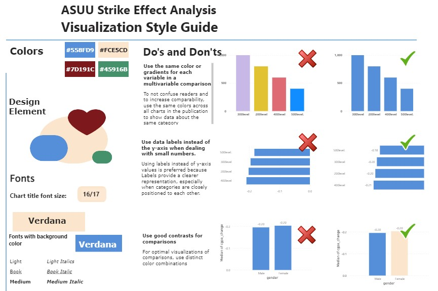
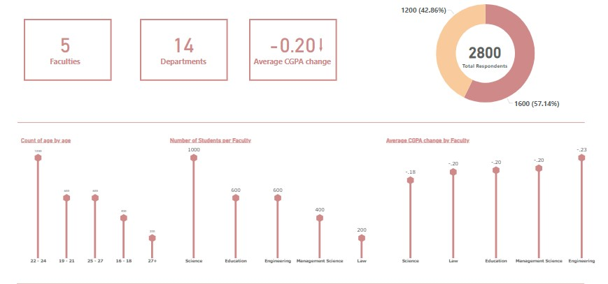
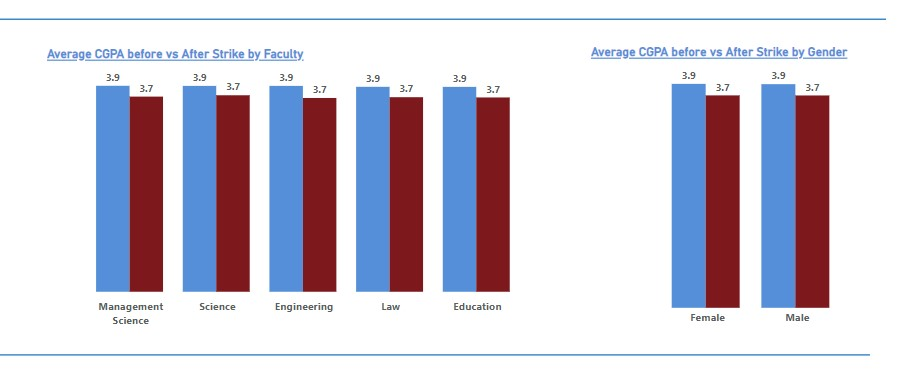

# Visualization Style Guide

  

## Color Palette

We will use the following colors in our visualizations:

- Primary Colors
    | Color Name | Color Sample | Color Hex |
    |------------|--------------|--------------|
    | Blue       |  | #558fd9 |
    | Cream      |  | #f9cb9c |

- Secondary Colors
    | Color Name | Color Sample | Color Hex |
    |------------|--------------|---------|
    | Red     |  | #7d191c |
    | Green    |  |45818e |

## Font

We will use **Verdana** as our font for all visualizations.

## Charts

When creating charts, we will follow these guidelines:

- Use clear and concise titles and labels for axes and legends
- Avoid cluttering charts with too much information
- Ensure the chart's color scheme is consistent with our color palette

## Examples

Here are some examples of visualizations that follow our style guide:

  
  

